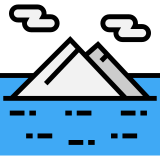
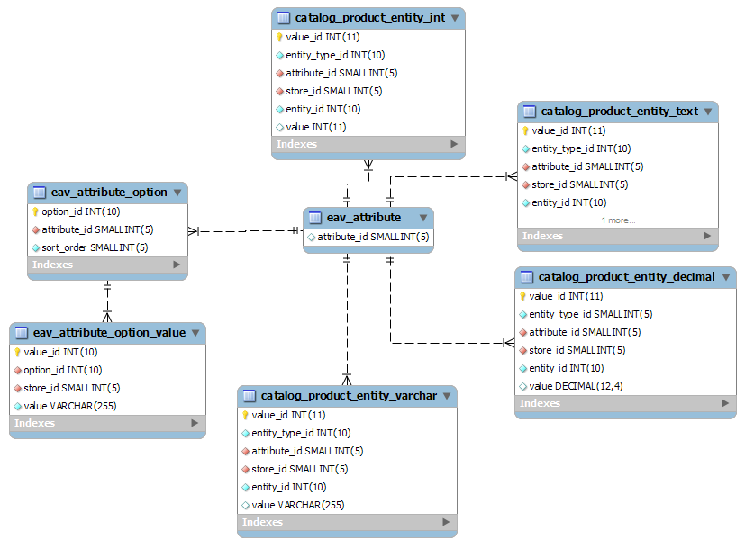

import { Head, Appear, Image } from 'mdx-deck'
import { future } from 'mdx-deck/themes'
import SyntaxHighlighter from 'react-syntax-highlighter/prism-light'
import atomDark from 'react-syntax-highlighter/styles/prism/atom-dark'

import FullPageImage from './components/full-page-image'
import TwitterLink from './components/twitter-link'

export const theme = future

<Head>
	<title>MongoDB Workshop</title>
</Head>


MongoDB com PHP:<br />
_pensando NoSQL_

<br />
<br />

<TwitterLink href="https://twitter.com/ravanscafi">
    @ravanscafi
</TwitterLink>

---

<SyntaxHighlighter language='javascript' style={atomDark}>
    {`db.users.findOne({name: "Ravan Scafi"})`}
</SyntaxHighlighter>

---

<SyntaxHighlighter language='javascript' style={atomDark}>
{`{
	"_id" : ObjectId("5d8ba3584bc1688665b19199"),
	"name" : "Ravan Scafi",
    "blog" : "https://ravan.me",
    "company" : {
        "name": "Leroy Merlin",
        "role": "Backend Developer"
    }
	"communities" : [ "PHPSP", "LaravelSP" ],
	"created_at" : ISODate("2019-09-25T17:27:07.709Z"),
	"updated_at" : ISODate("2019-09-25T17:27:07.709Z")
}`}
</SyntaxHighlighter>

---

# :warning:

O conteúdo é só a ponta do Iceberg 



---

# :warning:

Pode levantar a mão a qualquer momento!

# :raising_hand:

---

<FullPageImage src="images/prisma-comparison.jpg" alt="Comparing Database Types" />

---

# MongoDB

<Appear>
<li>NoSQL</li>
<li>Schemaless</li>
<li>Document-based</li>
<li>"JSON"</li>
</Appear>
---

<FullPageImage src="images/db-ranking.png" alt="DB-Engine Ranking" />

---

# Bora lá então :)

---

## Subindo no Docker

<SyntaxHighlighter language='bash' style={atomDark}>
{`docker run --name mongo-test -p 27017:27017 -d mongo\n
docker exec -it mongo-test mongo`}
</SyntaxHighlighter>

---

## [MongoDB Compass](https://www.mongodb.com/download-center/compass)

---

(ok, agora pode descer)

<SyntaxHighlighter language='bash' style={atomDark}>
{`docker stop mongo-test\n
docker rm mongo-test`}
</SyntaxHighlighter>

---

<FullPageImage src="images/leroy-home.jpg" alt="Leroy Merlin - Home" />

---

<FullPageImage src="images/leroy-furadeira.jpg" alt="Leroy Merlin - Furadeira" />

---

<FullPageImage src="images/leroy-cimento.jpg" alt="Leroy Merlin - Cimento" />

---

<FullPageImage src="images/leroy-churrasqueira.jpg" alt="Leroy Merlin - Churrasqueira" />

---

<FullPageImage src="images/leroy-almofada.jpg" alt="Leroy Merlin - Almofada" />

---

<FullPageImage src="images/leroy-palmeira.jpg" alt="Leroy Merlin - Palmeira" />

---

## Tá, e aí?

---

<FullPageImage src="images/devo-usar-mongodb.png" alt="Devo usar MongoDB e NoSQL?" />

---

# Modelo EAV
### Entity-Attribute-Value

(é o modelo do Magento)

---



---

<FullPageImage src="images/doctrine-mongodb.png" alt="Doctrine MongoDB" />

---

<FullPageImage src="images/jenssegers-mongodb.png" alt="Jenssegers Laravel-MongoDB" />

---

E então...

---

<FullPageImage src="images/mongolid.png" alt="Mongolid" />

---

# Mongolid Laravel

---

# Aplicação

```bash
git clone git@github.com:ravanscafi/mongodb-workshop-base.git
cd mongodb-workshop-base
```

---

```bash
cp .env.example .env
docker-compose up -d
docker-compose exec web php artisan key:generate
docker-compose exec web composer install
```

e abrir o [localhost](http://localhost)

---

# Recursos

- [Comparing Database Types: How Database Types Evolved to Meet Different Needs](https://www.prisma.io/blog/comparison-of-database-models-1iz9u29nwn37)
- [DB-Engines Ranking](https://db-engines.com/en/ranking)
- [Devo usar NoSQL e MongoDB?](https://medium.com/leroy-merlin-brasil-tech/devo-usar-nosql-e-mongodb-951693aa0d34)

---

# Onde ir a seguir?

- [Mongolid](https://github.com/leroy-merlin-br/mongolid/)
- [Mongolid Laravel](https://github.com/leroy-merlin-br/mongolid-laravel/)
- [MongoDB University](https://university.mongodb.com/)
- [Mongoose](https://mongoosejs.com/)
- [MongoDB Compass](https://www.mongodb.com/download-center/compass)

---
<div style={{width: '100vw', height: '100vh', backgroundColor: '#f2f2f2', display: 'flex', alignItems: 'center', justifyContent: 'center', flexDirection: 'column', color: '#020202'}}>


<br />

## Estamos Contratando!

[bit.ly/leroymerlin-backend](http://bit.ly/leroymerlin-backend)<br />
[bit.ly/leroymerlin-devops](http://bit.ly/leroymerlin-devops)<br />
[bit.ly/leroymerlin-frontend](http://bit.ly/leroymerlin-frontend)

</div>

---

# Obrigado!

<TwitterLink href="https://twitter.com/ravanscafi">
    @ravanscafi
</TwitterLink>
