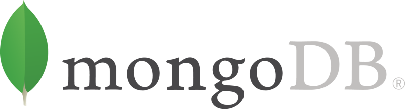

import { Head } from 'mdx-deck'
import { future } from '@mdx-deck/themes'
import prism from '@mdx-deck/themes/syntax-highlighter-prism'
export const theme = prism(future)

<Head>
	<title>MongoDB Workshop</title>
</Head>



O que você precisa saber para começar

---

# MongoDB

- NoSQL
- Schemaless
- Document-based
- "JSON"

---

<iframe src="https://db-engines.com/en/ranking" style={{width: '98vw', height: '98vh'}}>
</iframe>

---

<iframe src="https://techblog.leroymerlin.com.br/2017-08-08-devo-usar-nosql-e-mongodb/" style={{width: '98vw', height: '98vh'}}>
</iframe>

---

# Bora lá então :)

---

## Subindo no Docker

```bash
docker run --name mongo-test -p 27017:27017 -d mongo
docker exec -it mongo-test mongo
```

---

## [MongoDB Compass](https://www.mongodb.com/download-center/compass)

---

## Tá, e aí?

---

# Mongolid


---

# Mongolid Laravel

---

# Aplicação

```
git clone \
    git@github.com:ravanscafi/mongodb-workshop-base.git
cd mongodb-workshop-base
```

---

```bash
cp .env.example .env
docker-compose up -d
docker-compose exec web php artisan key:generate
docker-compose exec web composer install
```

e abrir o [localhost](http://localhost)

---

# Recursos

- [Mongolid](https://github.com/leroy-merlin-br/mongolid/)
- [Mongolid Laravel](https://github.com/leroy-merlin-br/mongolid-laravel/)
- [MongoDB University](https://university.mongodb.com/)
- [Mongoose](https://mongoosejs.com/)
