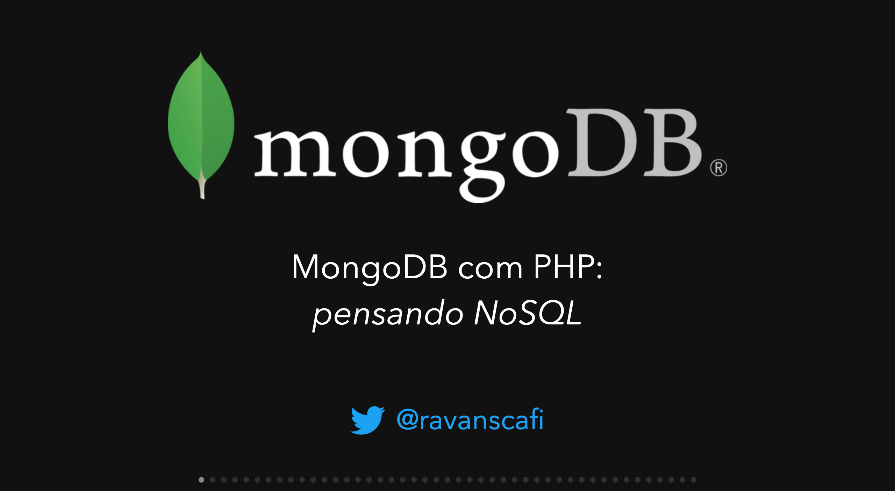

# PHP + MongoDB Workshop 🇧🇷

Slides for my MongoDB Workshop, made in Brazilian Portuguese for [PHP Community Summit](https://php.locaweb.com.br/).

It's currently hosted at [my website](https://mongodb-workshop.ravan.me/).

I've used the awesome [mdx-deck](https://github.com/jxnblk/mdx-deck) project and a lot of jerry-rigs, sorry.

Note to future self: There's a <kbd>opt</kbd>+<kbd>f</kbd> command to go fullscreen.

## Development

### `yarn start`

Start mdx-deck on localhost:8080.
Edit any file and see live updates.

### `yarn build`
Create a `dist` folder with html and js files,
ready to deploy.

## Contributing

Not sure why/how someone could contribute but yeah, go ahead if you want to.

## License

MIT
